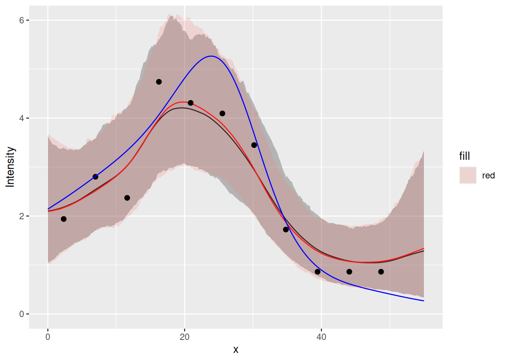
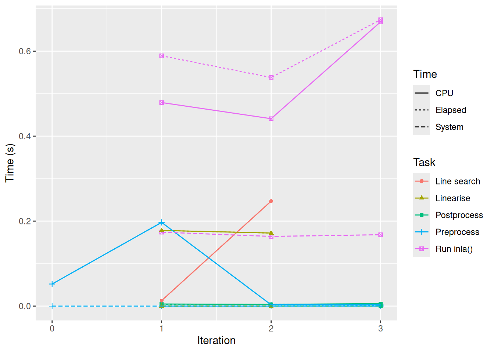
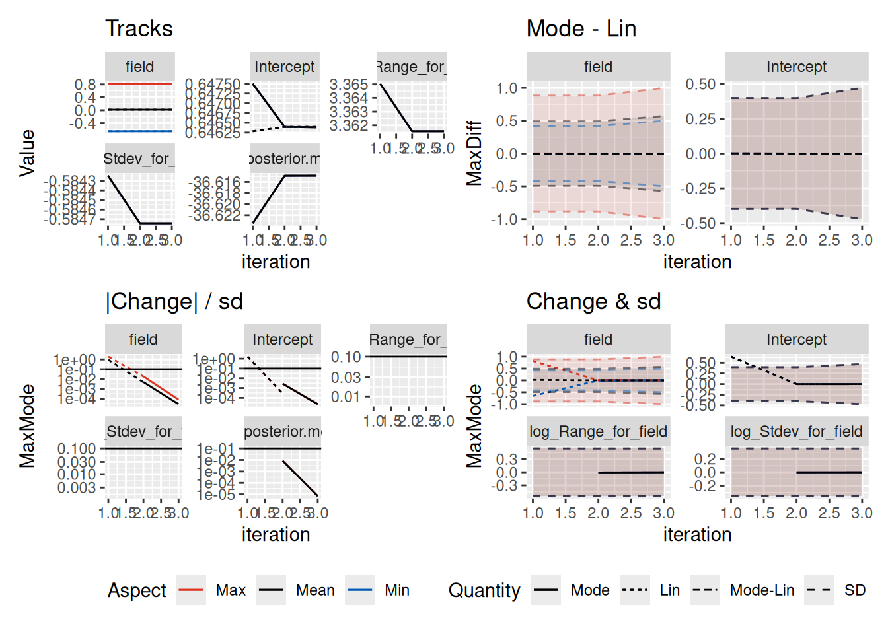

# Aggregated count models in one dimension

This tutorial modifies the [1D random
fields](https://inlabru-org.github.io/inlabruCourseMay2025/articles/random_fields_1d.md)
tutorial to properly handle aggregated counts.

## Setting things up

``` r
library(INLA)
library(inlabru)
library(mgcv)
library(ggplot2)
library(fmesher)
library(patchwork)
```

Make a shortcut to a nicer colour scale:

``` r
colsc <- function(...) {
  scale_fill_gradientn(
    colours = rev(RColorBrewer::brewer.pal(11, "RdYlBu")),
    limits = range(..., na.rm = TRUE)
  )
}
```

## Get the data

Load the data and rename the countdata object to `cd` (just because
‘`cd`’ is less to type than ‘`countdata2`’.):

``` r
data(Poisson2_1D)
cd <- countdata2
```

Take a look at the count data.

``` r
cd
#>            x count exposure
#> 1   2.319888     9 4.639776
#> 2   6.959664    13 4.639776
#> 3  11.599439    11 4.639776
#> 4  16.239215    22 4.639776
#> 5  20.878991    20 4.639776
#> 6  25.518766    19 4.639776
#> 7  30.158542    16 4.639776
#> 8  34.798318     8 4.639776
#> 9  39.438093     4 4.639776
#> 10 44.077869     4 4.639776
#> 11 48.717645     4 4.639776
ggplot(cd) +
  geom_point(aes(x, y = count)) +
  ylim(0, max(cd$count))
```


*Tip*: `RStudio > Help > Cheatsheets > Data visualisation with ggplot2`
is a useful reference for `ggplot2` syntax.

## Fitting an SPDE model with inlabru

Make mesh. To avoid boundary effects in the region of interest, let the
mesh extend outside the data range.

``` r
x <- seq(-10, 65, by = 0.5) # this sets mesh points - try others if you like
(mesh1D <- fm_mesh_1d(x, degree = 2, boundary = "free"))
#> fm_mesh_1d object:
#>   Manifold:  R1
#>   #{knots}:  151
#>   Interval:  (-10,  65)
#>   Boundary:  (free, free)
#>   B-spline degree:   2
#>   Basis d.o.f.:  152
```

### Using function `bru( )` to fit to aggregated count data

We need to specify model components and a model formula in order to fit
it. This can be done inside the call to
[`bru( )`](https://inlabru-org.github.io/inlabru/reference/bru.html) but
that is a bit messy, so we’ll store it in `comp` first and then pass
that to
[`bru( )`](https://inlabru-org.github.io/inlabru/reference/bru.html).

Our response variable in the data frame `cd` is called `count` so the
model specification needs to have that on the left of the `~`. We add an
intercept component with `+ Intercept(1)` on the right hand side (all
the models we use have intercepts), and because we want to fit a
Gaussian random field (GRF), it must have a GRF specification. In
`inlabru` the GRF specification is a function, which allows the GRF to
be calculated at any point in space while `inlabru` is doing its
calculations.

The user gets to name the GRF function. The syntax is
`myname(input, model= ...)`, where:

- ‘myname’ is whatever you want to call the GRF (we called it `field`
  below);
- `input` specifies the coordinates in which the GRF or SPDE ‘lives’.
  Here we are working in one dimension, and we called that dimension `x`
  when we set up the data set.
- `model=` designates the type of effect, here an SPDE model object from
  the `INLA` function
  [`inla.spde2.pcmatern( )`](https://rdrr.io/pkg/INLA/man/inla.spde2.pcmatern.html),
  which requires a mesh to be passed to it, so we pass it the 1D mesh
  that we created above, `mesh1D`.

For models that only sums all the model components, we don’t need to
specify the full predictor formula. Instead, we can provide the name of
the output to the left of the `~` in the component specification, and
“.” on the right hand side, which will cause it to add all components
(unless a subset is selected via the `used` argument to
[`bru_obs()`](https://inlabru-org.github.io/inlabru/reference/bru_obs.html)).

``` r
the_spde <- inla.spde2.pcmatern(mesh1D,
  prior.range = c(1, 0.01),
  prior.sigma = c(1, 0.01)
)

comp <- ~ field(x, model = the_spde) + Intercept(1, prec.linear = 1 / 2^2)
```

Approximate model pretending that the counts are measured at individual
points:

``` r
fit2.bru <- bru(
  comp,
  bru_obs(
    count ~ .,
    data = cd,
    family = "poisson",
    E = exposure
  )
)

summary(fit2.bru)
#> inlabru version: 2.13.0.9024 
#> INLA version: 25.12.12 
#> Latent components:
#> field: main = spde(x)
#> Intercept: main = linear(1)
#> Observation models:
#>   Model tag: <No tag>
#>     Family: 'poisson'
#>     Data class: 'data.frame'
#>     Response class: 'integer'
#>     Predictor: count ~ field + Intercept
#>     Additive/Linear/Rowwise: TRUE/TRUE/TRUE
#>     Used components: effect[field, Intercept], latent[] 
#> Time used:
#>     Pre = 0.503, Running = 0.218, Post = 0.0961, Total = 0.818 
#> Fixed effects:
#>            mean    sd 0.025quant 0.5quant 0.975quant  mode kld
#> Intercept 0.626 0.479     -0.437    0.658       1.52 0.729   0
#> 
#> Random effects:
#>   Name     Model
#>     field SPDE2 model
#> 
#> Model hyperparameters:
#>                   mean     sd 0.025quant 0.5quant 0.975quant   mode
#> Range for field 35.074 19.904     10.922   30.470      86.45 23.073
#> Stdev for field  0.594  0.221      0.275    0.557       1.13  0.488
#> 
#> Marginal log-Likelihood:  -36.69 
#>  is computed 
#> Posterior summaries for the linear predictor and the fitted values are computed
#> (Posterior marginals needs also 'control.compute=list(return.marginals.predictor=TRUE)')
```

Model that takes into account that the expected counts are integrals:

``` r
data_integration <- fm_int(
  mesh1D,
  samplers = with(cd, cbind(x - exposure/2, x + exposure/2))
)
if (packageVersion("inlabru") >= "2.12.0.9016") {
  # From 2.12.0.9016:
  fit2block.bru <- bru(
    comp,
    bru_obs(
      count ~ .,
      data = data_integration,
      response_data = cd,
      aggregate = "logsumexp",
      family = "poisson"
    )
  )
} else {
  # Before 2.12.0.9016:
  fit2block.bru <- bru(
    comp,
    bru_obs(
      count ~ fm_block_logsumexp_eval(
        block = .block,
        weights = weight,
        n_block = NROW(cd),
        values = Intercept + field
      ),
      allow_combine = TRUE,
      data = data_integration,
      response_data = cd,
      family = "poisson"
    )
  )
}

summary(fit2block.bru)
#> inlabru version: 2.13.0.9024 
#> INLA version: 25.12.12 
#> Latent components:
#> field: main = spde(x)
#> Intercept: main = linear(1)
#> Observation models:
#>   Model tag: <No tag>
#>     Family: 'poisson'
#>     Data class: 'tbl_df', 'tbl', 'data.frame'
#>     Response class: 'integer'
#>     Predictor: ~ {ibm_eval(BRU_aggregate_mapper, input = BRU_aggregate_input, state = {field + Intercept})}
#>     Additive/Linear/Rowwise: FALSE/FALSE/FALSE
#>     Used components: effect[field, Intercept], latent[] 
#> Time used:
#>     Pre = 0.336, Running = 0.232, Post = 0.0829, Total = 0.65 
#> Fixed effects:
#>            mean    sd 0.025quant 0.5quant 0.975quant  mode kld
#> Intercept 0.627 0.471     -0.418    0.659      1.506 0.728   0
#> 
#> Random effects:
#>   Name     Model
#>     field SPDE2 model
#> 
#> Model hyperparameters:
#>                   mean     sd 0.025quant 0.5quant 0.975quant   mode
#> Range for field 33.590 19.718      9.978   28.954      84.61 21.549
#> Stdev for field  0.595  0.218      0.279    0.559       1.12  0.492
#> 
#> Marginal log-Likelihood:  -36.58 
#>  is computed 
#> Posterior summaries for the linear predictor and the fitted values are computed
#> (Posterior marginals needs also 'control.compute=list(return.marginals.predictor=TRUE)')
```

Predict the `lambda` function (the data argument must be a data frame,
see
[`?predict.bru`](https://inlabru-org.github.io/inlabru/reference/predict.bru.html)):

``` r
x4pred <- data.frame(x = seq(0, 55, by = 0.1))
pred2.bru <- predict(fit2.bru,
  x4pred,
  x ~ exp(field + Intercept),
  n.samples = 1000
)
pred2block.bru <- predict(fit2block.bru,
  x4pred,
  x ~ exp(field + Intercept),
  n.samples = 1000
)
```

Let’s do a plot to compare the fitted model to the true model. The true
`lambda` is given by the function `lambda2_1D()`, and the expected
counts of the true model are stored in the variable `E_nc2` which comes
with the dataset `Poisson2_1D`. For ease of use in plotting with
`ggplot2` (which needs a data frame), we create a data frame which we
call `true.lambda`, containing `x`- and `y` variables as shown below.

``` r
true.lambda <- data.frame(x = x4pred$x, lambda = lambda2_1D(x4pred$x))
```

These `ggplot2` commands should generate the plot shown below. It shows
the true intensities as a blue line, the observed intensities as black
dots, and the fitted intensity function as a red curve, with 95%
credible intervals shown as a light bands about the curves.

``` r
ggplot() +
  gg(pred2.bru) +
  gg(pred2block.bru,mapping = aes(fill="red"), alpha=0.2, color = "red") +
  geom_point(data = cd, aes(x = x, y = count / exposure), cex = 2) +
  geom_line(data = true.lambda, aes(x, lambda), col = "blue") +
  coord_cartesian(xlim = c(0, 55), ylim = c(0, 6)) +
  xlab("x") +
  ylab("Intensity")
#> Warning in ggplot2::geom_line(data = data, line.map, ...): Ignoring
#> unknown aesthetics: fill
```



We can see that for this toy problem, using the proper aggregated count
observation model doesn’t make a noticeable difference to the fitted
model. For more realistic settings, in particular those involving high
resolution covariates, the distinction becomes important, and the the
integration scheme to resolve small features.

The computational time is available from
[`bru_timings()`](https://inlabru-org.github.io/inlabru/reference/bru_timings.html):

``` r
bru_timings(fit2.bru)
#>          Task Iteration       Time     System    Elapsed
#> 1  Preprocess         0 0.074 secs 0.002 secs 0.076 secs
#> 2  Preprocess         1 0.067 secs 0.000 secs 0.068 secs
#> 3  Run inla()         1 0.796 secs 0.164 secs 0.844 secs
#> 4 Postprocess         1 0.005 secs 0.000 secs 0.006 secs
bru_timings(fit2block.bru)
#>           Task Iteration       Time     System    Elapsed
#> 1   Preprocess         0 0.052 secs 0.000 secs 0.052 secs
#> 2   Preprocess         1 0.197 secs 0.000 secs 0.197 secs
#> 3   Run inla()         1 0.479 secs 0.174 secs 0.589 secs
#> 4  Postprocess         1 0.005 secs 0.000 secs 0.004 secs
#> 5  Line search         1 0.013 secs 0.000 secs 0.013 secs
#> 6    Linearise         1 0.178 secs 0.000 secs 0.178 secs
#> 7   Preprocess         2 0.003 secs 0.000 secs 0.003 secs
#> 8   Run inla()         2 0.441 secs 0.164 secs 0.538 secs
#> 9  Postprocess         2 0.004 secs 0.000 secs 0.004 secs
#> 10 Line search         2 0.247 secs 0.000 secs 0.247 secs
#> 11   Linearise         2 0.172 secs 0.000 secs 0.172 secs
#> 12  Preprocess         3 0.003 secs 0.000 secs 0.002 secs
#> 13  Run inla()         3 0.669 secs 0.168 secs 0.674 secs
#> 14 Postprocess         3 0.006 secs 0.000 secs 0.005 secs
bru_timings_plot(fit2block.bru)
```



To check the iterative method convergence, use
[`bru_convergence_plot()`](https://inlabru-org.github.io/inlabru/reference/bru_convergence_plot.html):

``` r
bru_convergence_plot(fit2block.bru)
#> `geom_line()`: Each group consists of only one observation.
#> ℹ Do you need to adjust the group aesthetic?
#> `geom_line()`: Each group consists of only one observation.
#> ℹ Do you need to adjust the group aesthetic?
#> `geom_line()`: Each group consists of only one observation.
#> ℹ Do you need to adjust the group aesthetic?
#> `geom_line()`: Each group consists of only one observation.
#> ℹ Do you need to adjust the group aesthetic?
```


