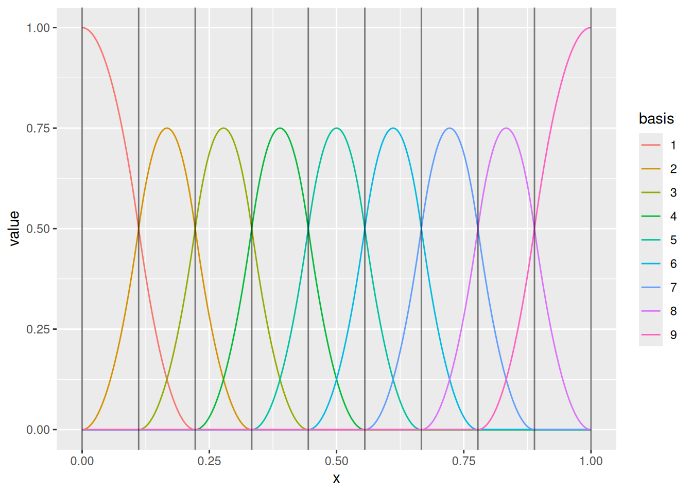
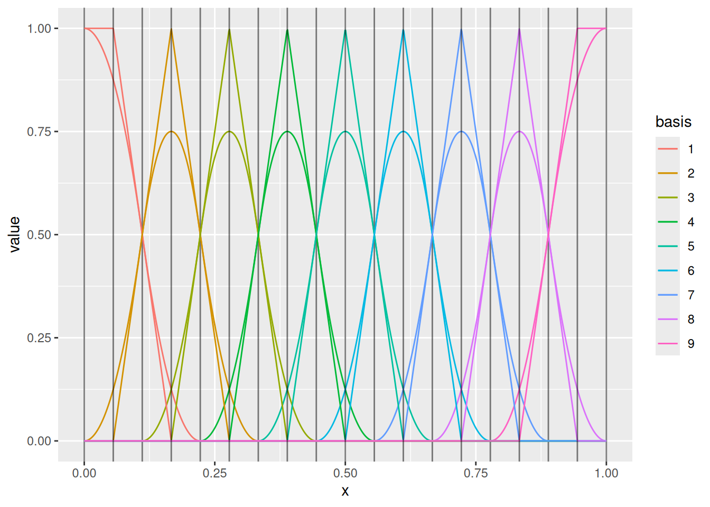
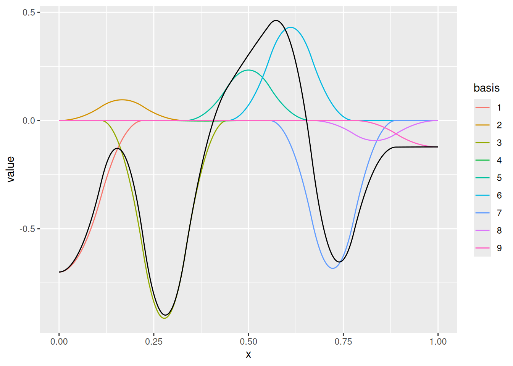
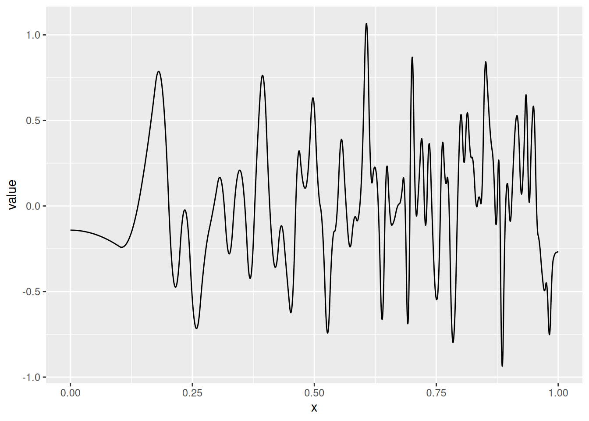
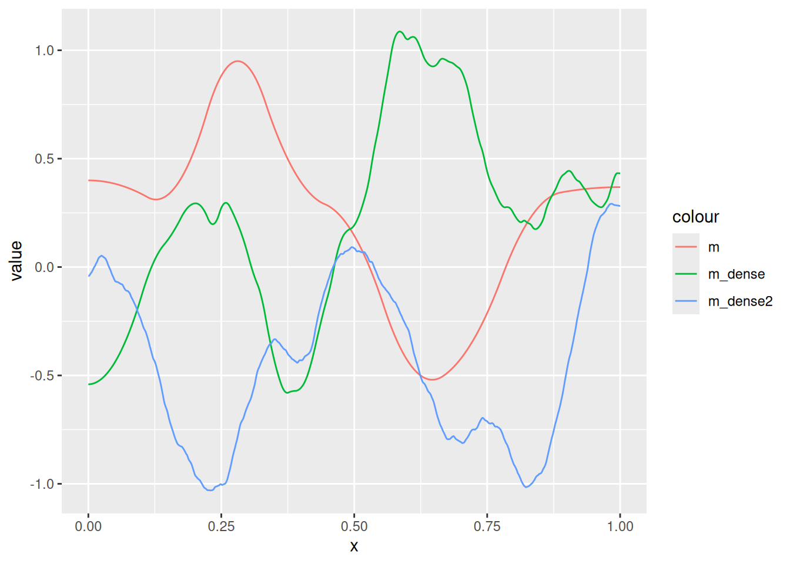
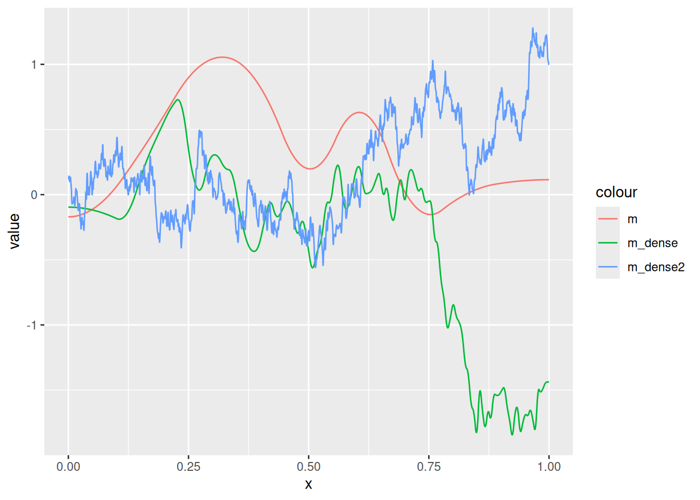
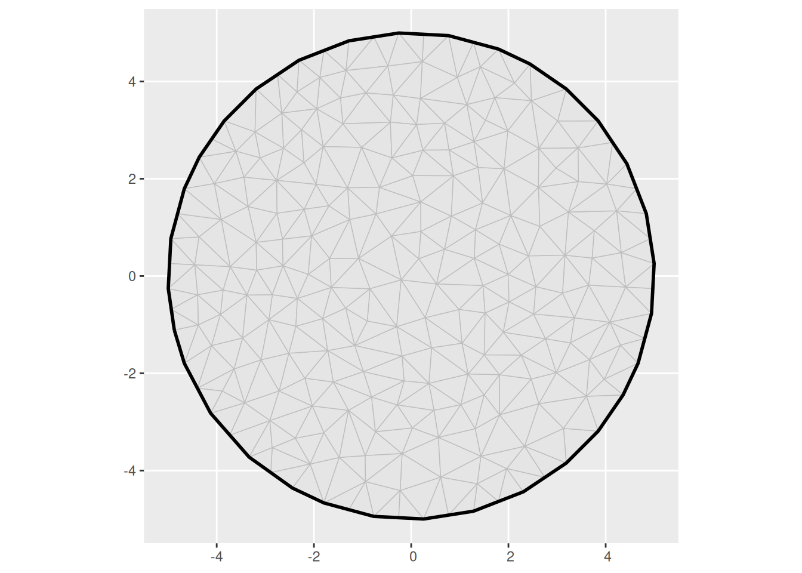
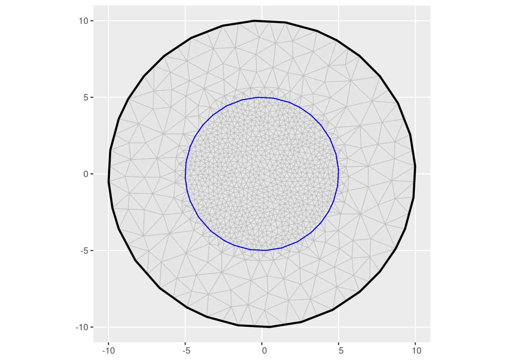
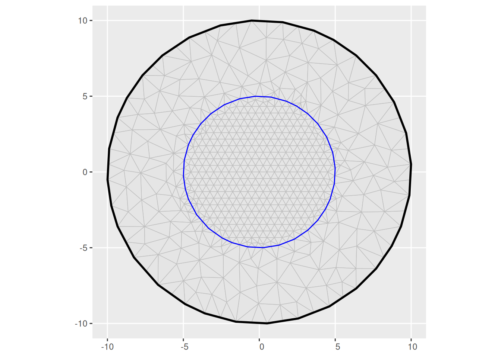

# Random field and latent models

The main references to the INLA method and the inlabru software are

- [Rue, Martino, and Chopin (2009)](#ref-rue2009inla)
- [Bachl et al. (2019)](#ref-bachl2019inlabru)
- [Finn Lindgren et al.
  (2024)](#ref-lindgren2024inlabrusoftwarefittinglatent) (currently
  being revised)

The main references to the stochastic PDE method for constructing
stationary and non-stationary continuous domain random field models
represented by Gaussian Markov random fields are

- [Finn Lindgren, Rue, and Lindström (2011)](#ref-lindgren2011spde)
- [Finn Lindgren, Bolin, and Rue (2022)](#ref-lindgren2022spde10years)
- [F. Lindgren et al. (2024)](#ref-lindgren2024spacetime)

## Spatial dependence structures

### Independent Gaussians

### Graph dependent structures; Markov random fields

#### Discrete variables

#### Continuous variables; Gaussian MRFs

Covariance and Precision matrices

Multivariate vectors with covariance and precision representation of the
dependence: \\ \begin{aligned} u &\sim N(\mu_u,\Sigma_u) \\ u &\sim
N(\mu_u,Q_u^{-1}) \end{aligned} \\ Observations with additive noise: \\
y\|u \sim N(\eta = b + A u, Q\_\epsilon^{-1}) \\ Joint covariance: \\
\Sigma\_{(u,y)} = \begin{bmatrix} \Sigma_u & \Sigma_u A^\top \\ A^\top
\Sigma_u & A \Sigma_u A^\top + Q\_\epsilon^{-1} \end{bmatrix} \\

Joint precision: \\ Q\_{(u,y)} = \begin{bmatrix} Q_u + A^\top
Q\_\epsilon A & -A^\top Q\_\epsilon \\ -Q\_\epsilon A & Q\_\epsilon
\end{bmatrix} \\

Conditional distributions: \\ \begin{aligned} u\|y &\sim
N(\mu\_{u\|y},\Sigma\_{u\|y}) \\ \Sigma_y &= A \Sigma_u A^\top +
Q\_\epsilon^{-1} \\ \Sigma\_{u\|y} &= \Sigma_u - \Sigma_u A^\top
\Sigma_y^{-1} A \Sigma_u \\ \mu\_{u\|y} &= \mu_u + \Sigma_u A^\top
\Sigma_y^{-1} (y - b - A \mu_u) \\ \end{aligned} \\ and \\
\begin{aligned} u\|y &\sim N(\mu\_{u\|y},Q\_{u\|y}^{-1}) \\ Q\_{u\|y} &=
Q_u + A^\top Q\_\epsilon A \\ \mu\_{u\|y} &= \mu_u + Q\_{u\|y}^{-1}
A^\top Q\_\epsilon (y - b - A \mu_u) \end{aligned} \\

### Gaussian processes/random fields

#### Covariance functions

#### Precision operators; SPDEs and GMRFs

#### Basis function representations

``` r
(m <- fm_mesh_1d(
  loc = seq(0, 1, length.out = 10),
  degree = 2
))
#> fm_mesh_1d object:
#>   Manifold:  R1
#>   #{knots}:  10
#>   Interval:  (0, 1)
#>   Boundary:  (neumann, neumann)
#>   B-spline degree:   2
#>   Basis d.o.f.:  9
ggplot() +
  geom_fm(data = m)
```



``` r
(m1 <- fm_mesh_1d(m$mid, degree = 1))
#> fm_mesh_1d object:
#>   Manifold:  R1
#>   #{knots}:  9
#>   Interval:  (0.05555556, 0.94444444)
#>   Boundary:  (neumann, neumann)
#>   B-spline degree:   1
#>   Basis d.o.f.:  9
ggplot() +
  geom_fm(data = m) +
  geom_fm(data = m1, xlim = m$interval)
```



``` r
ggplot() +
  geom_fm(data = m, weights = rnorm(fm_dof(m), sd = 0.5), knots = FALSE)
```



Changing the knot sequence but keeping the weights independent
drastically changes the model.

``` r
(m_dense <- fm_mesh_1d(
  loc = seq(0, 1, length.out = 100)^0.5,
  degree = 2
))
#> fm_mesh_1d object:
#>   Manifold:  R1
#>   #{knots}:  100
#>   Interval:  (0, 1)
#>   Boundary:  (neumann, neumann)
#>   B-spline degree:   2
#>   Basis d.o.f.:  99
ggplot() +
  geom_fm(
    data = m_dense,
    weights = rnorm(fm_dof(m_dense), sd = 0.5),
    knots = FALSE,
    basis = FALSE
  )
```



The SPDE approach provides a method for constructing basis weight
dependence structures that are consistent when changing the knot
sequence and/or the basis functions, by projecting a continuously
defined process model onto the function space defined by any given set
of basis functions. The main requirement is that the basis functions
need to be able to resolve features down to a certain scale, as
determined by the correlation length of the process model.

``` r
(m_dense2 <- fm_mesh_1d(
  loc = seq(0, 1, length.out = 1000),
  degree = 2
))
#> fm_mesh_1d object:
#>   Manifold:  R1
#>   #{knots}:  1000
#>   Interval:  (0, 1)
#>   Boundary:  (neumann, neumann)
#>   B-spline degree:   2
#>   Basis d.o.f.:  999
Q_m <- fm_matern_precision(m, alpha = 2, rho = 0.3, sigma = 0.5)
Q_m_dense <- fm_matern_precision(m_dense, alpha = 2, rho = 0.3, sigma = 0.5)
Q_m_dense2 <- fm_matern_precision(m_dense2, alpha = 2, rho = 0.3, sigma = 0.5)
ggplot() +
  geom_fm(
    data = m,
    mappings = list(fun = aes(col = "m")),
    weights = fm_sample(1, Q_m),
    knots = FALSE,
    basis = FALSE
  ) +
  geom_fm(
    data = m_dense,
    mappings = list(fun = aes(col = "m_dense")),
    weights = fm_sample(1, Q_m_dense),
    knots = FALSE,
    basis = FALSE
  ) +
  geom_fm(
    data = m_dense2,
    mappings = list(fun = aes(col = "m_dense2")),
    weights = fm_sample(1, Q_m_dense2),
    knots = FALSE,
    basis = FALSE
  )
```



``` r
(m_dense2 <- fm_mesh_1d(
  loc = seq(0, 1, length.out = 1000),
  degree = 2
))
#> fm_mesh_1d object:
#>   Manifold:  R1
#>   #{knots}:  1000
#>   Interval:  (0, 1)
#>   Boundary:  (neumann, neumann)
#>   B-spline degree:   2
#>   Basis d.o.f.:  999
Q_m <- fm_matern_precision(m, alpha = 1, rho = 0.3, sigma = 0.5)
Q_m_dense <- fm_matern_precision(m_dense, alpha = 1, rho = 0.3, sigma = 0.5)
Q_m_dense2 <- fm_matern_precision(m_dense2, alpha = 1, rho = 0.3, sigma = 0.5)
ggplot() +
  geom_fm(
    data = m,
    mappings = list(fun = aes(col = "m")),
    weights = fm_sample(1, Q_m),
    knots = FALSE,
    basis = FALSE
  ) +
  geom_fm(
    data = m_dense,
    mappings = list(fun = aes(col = "m_dense")),
    weights = fm_sample(1, Q_m_dense),
    knots = FALSE,
    basis = FALSE
  ) +
  geom_fm(
    data = m_dense2,
    mappings = list(fun = aes(col = "m_dense2")),
    weights = fm_sample(1, Q_m_dense2),
    knots = FALSE,
    basis = FALSE
  )
```



### 2D

``` r
(m <- fm_mesh_2d(
  boundary = list(fm_nonconvex_hull_inla(cbind(0, 0), convex = 5)),
  max.edge = 1
))
#> Warning: `fm_nonconvex_hull_inla()` was deprecated in fmesher 0.4.0.9002.
#> ℹ Please use the `format` argument of `fm_nonconvex_hull()` instead.
#> ℹ The `fm_nonconvex_hull()` method with `method = "fm"` and `format = "fm"` has
#>   replaced `fm_nonconvex_hull_inla()`. Most use cases can use
#>   `fm_nonconvex_hull(...)` for `sf` output, which since version `0.4.0.9002`
#>   uses the "fm" method by default.
#> This warning is displayed once every 8 hours.
#> Call `lifecycle::last_lifecycle_warnings()` to see where this warning was
#> generated.
#> fm_mesh_2d object:
#>   Manifold:  R2
#>   V / E / T: 233 / 642 / 410
#>   Euler char.:   1
#>   Constraints:   Boundary: 54 boundary edges (1 group: 1), Interior: 0 edges
#>   Bounding box: (-4.996242, 4.996242) x (-4.996242, 4.996242)
#>   Basis d.o.f.:  233
ggplot() +
  geom_fm(data = m)
```



``` r
(m2 <- fm_mesh_2d(
  boundary = fm_extensions(cbind(0, 0), convex = c(5, 10)),
  max.edge = c(0.5, 2)
))
#> fm_mesh_2d object:
#>   Manifold:  R2
#>   V / E / T: 1064 / 3134 / 2071
#>   Euler char.:   1
#>   Constraints:   Boundary: 55 boundary edges (1 group: 1), Interior: 105 interior edges (1 group: 1)
#>   Bounding box: (-9.992483, 9.992483) x (-9.992483, 9.992483)
#>   Basis d.o.f.:  1064
ggplot() +
  geom_fm(data = m2)
```



``` r
bnd <- fm_extensions(cbind(0, 0), convex = c(5, 10))
(m3 <- fm_mesh_2d(
  loc = fm_hexagon_lattice(bnd[[1]], edge_len = 0.5),
  boundary = bnd,
  max.edge = c(0.6, 2)
))
#> fm_mesh_2d object:
#>   Manifold:  R2
#>   V / E / T: 623 / 1812 / 1190
#>   Euler char.:   1
#>   Constraints:   Boundary: 54 boundary edges (1 group: 1), Interior: 73 interior edges (1 group: 1)
#>   Bounding box: (-9.992483, 9.992483) x (-9.992483, 9.992483)
#>   Basis d.o.f.:  623
ggplot() +
  geom_fm(data = m3)
```



## Observations

### Coupling latent variables to observations

While observations are almost always finite-dimensional, the latent
variables and random effects are often infinite-dimensional, at least
conceptually. This means that we need to be careful about how we link
the observations to the latent variables. The benefit of this way of
thinking is that it allows us to link misaligned observation structures
to the same latent models, and we can jointly model different types of
observations without necessarily having to adapt the latent structures.

### Point/Georeferenced data

Classical geostatistical models with additive Gaussian noise: \\ y_i =
\eta(s_i) + \epsilon_i \\

Poisson counts at given locations: \\ y_i \sim \text{Po}(e^{\eta(s_i)}
ds) \\

### Areal/aggregated data

If our observations were constructed by aggregation over a region
\\B_i\\, we need to determine how the aggregated values link to the
continuous domain predictor.

For an averaged predictor with additive Gaussian noise: \\ y_i =
\frac{1}{\|B_i\|}\int\_{B_i} \eta(s) ds + \epsilon_i \\ If our data
consists of sums of Poisson counts at different locations, we get \\
y\_{B_j} = \\\\i; s_i\in B_j\\ \sim \text{Po}\left(\sum\_{s_i\in B_j}
e^{\eta(s_i)}\right) \\ Note that this is not the same as aggregating
the linear predictor itself, due to the nonlinear transformation. Also
note that the situation is much more complicated for non-Poisson count
models, since for example the sum of two independent Binomial variables,
\\\text{Bin}(n_1, p_1)+\text{Bin}(n_2, p_2)\\ is not itself Binomial
unless \\p_1=p_2\\.

If our data consists of counts of Poisson process point pattern data
\\\\s_i;i=1\dots,N(\Omega)\\\\, aggregated to regions \\B_j\\, we can
use the following model, directly based on the properties of a Posson
point process. \\ y\_{B_j} = \\\\i; s_i\in B_j\\ \sim
\text{Po}\left(\int\_{B_j} e^{\eta(s)} \\ds\right) \\

### Point pattern data

A Poisson point process is a random process that generates points in
space such that the count of points in any given set \\B\\ is Poisson
distributed with expectation \\\Lambda(B)=\int_B \lambda(s)\\ds\\, where
\\\lambda(s)\\ is the intensity function. Log-Gaussian Cox processes are
obtained with \\\lambda(s)=e^{\eta(s)}\\ when \\\eta(s)\\ is a Gaussian
random field. A Poisson process point pattern on a sampling region
\\\Omega\\ is a set with conditional distribution \\ \\s_i;s_i\in
\Omega\\ \sim \text{PoPr}\left(e^{\eta(\cdot)}\right) \\ This means that
for every set \\B\subseteq\Omega\\, \\ \\\\s_i;s_i\in B\\ \sim
\text{Po}\left(\int_B e^{\eta(s)}\\ds\right) . \\

## Latent Gaussian models for geostatistics

INLA implements models where each observation \\y_i\\ is linked to an
element of a linear predictor vector, \\\eta_i\\, that typically
controls the location parameter of the observation model, through a link
function \\g(\cdot)\\, with conditional independence, given \\\eta\\.

The linear predictor

### Spatial covariates

### Independent random effects

### Structured random effects

### Coupling latent models to several types of data

## `inlabru` model structure

### Classic INLA

Classic `INLA` model formulas are designed to closely follow basic
additive model formula syntax, such as

``` r
response ~ 1 + covariate1 + covariate2 + f(field, model = model_name)
```

This defines a model with a linear predictor of the form \\ \eta_i =
\beta_0 + \beta_1 x\_{i,1} + \beta_2 x\_{i,2} + u_i \\ where
\\\beta_0\\, \\\beta_1\\, and \\\beta_2\\ are independent Gaussian
scalars, and \\u_i\\ is an unstructured or structured latent Gaussian
random effect.

For [`INLA::f()`](https://rdrr.io/pkg/INLA/man/f.html) components, the
name of the input variable also becomes the name of the effect.

For spatial models, the `field` variable would need to be defined as an
index into the mesh nodes, usually constructed with
[`inla.spde.make.index()`](https://rdrr.io/pkg/INLA/man/inla.spde.make.index.html),
and
[`inla.spde.make.A()`](https://rdrr.io/pkg/INLA/man/inla.spde.make.A.html)
and [`inla.stack()`](https://rdrr.io/pkg/INLA/man/inla.stack.html) used
to construct the mapping information required to inform INLA about how
the nodes are linked to the observations.

One of the aims of `inlabru` is to provide a more compact and flexible
syntax for defining models, by automatically handling the mapping
between structured latent variables and observations.

If you’ve used the “raw” INLA approach, please consult [Converting
`inla.spde.make.A` calls into the `bru_mapper`
system](https://inlabru-org.github.io/inlabru/articles/mesh_mapping.html).

### inlabru

`inlabru` uses a conceptual information flow for model definition:

- latent model components
- component effects
- predictor expressions
- observation models

#### Model components and effects

Model components are defined in a way that decouples the input data
names from the effect of each model component. This allows the same
variable to be involved in several components, without the need for
creating dummies and copies.

Each component takes a general R expression as input, which is evaluated
in the context of the observation model data. The
[`bru_mapper()`](https://inlabru-org.github.io/inlabru/reference/bru_mapper.html)
system is used to construct per-component model matrices, which are then
combined into a joint model matrix based on the predictor expressions.

The basic syntax is `effect_name(input_variable, model = ...)`, which
defines an effect of the input variable, using the specified model. The
model can be any INLA model, such as `"iid"`, `"ar1"`, `"rw2"`,
`"bym2"`, a
[`inla.spde2.pcmatern()`](https://rdrr.io/pkg/INLA/man/inla.spde2.pcmatern.html)
model object, or a user-defined model (rgeneric/cgeneric). The standard
INLA models have default mappers associated with them, and a
user-defined model can be associated with a mapper using a
[`bru_get_mapper()`](https://inlabru-org.github.io/inlabru/reference/bru_get_mapper.html)
method, or explicitly provided by the user.

The default input expression is the name of the components, so that
classical effects can be written as `+ covar`, which is shorthand for
`+ covar(covar, model = "linear")`.

``` r
response ~ Intercept(1) +
  covariate1 +
  covariate2 +
  field(geometry, model = inla.spde2.pcmatern(...))
```

Here, the component effect is called `field`, the input is the
`geometry` variable from `sf` data, and the mapper is an automatically
constructed
[`bru_mapper_fmesher()`](https://inlabru-org.github.io/inlabru/reference/bm_fmesher.html)
mapper for the mesh used in the `model` definition.

There are two kinds of mappers; Non-indexed mappers provide raw
covariate values as input to
[`INLA::f()`](https://rdrr.io/pkg/INLA/man/f.html), which is used for
fixed effects and `rw1`/`rw2` models. Indexed mappers are used to build
models on integers or categories.

For more details on component definitions, see [Defining model
components](https://inlabru-org.github.io/inlabru/articles/component.html)
and the in-depth discussion of the mapper system, including how to
define more complex fixed effects components (`model="fixed"` together
with
[`bru_mapper_matrix()`](https://inlabru-org.github.io/inlabru/reference/bm_matrix.html)
)and custom mappers, [Customised model components with the `bru_mapper`
system](https://inlabru-org.github.io/inlabru/articles/bru_mapper.html).

#### Predictor expressions

For compatibility with basic glm formulas, `inlabru` by default
constructs a predictor expression that adds all the component effects,
with the response variable named to the left of the `~` operator. The
following code,

``` r
bru(
  response ~ Intercept(1) +
    covariate1 +
    covariate2 +
    field(geometry, model = inla.spde2.pcmatern(...)),
  ...
)
```

is equivalent to

``` r
bru(
  ~ Intercept(1) +
    covariate1 +
    covariate2 +
    field(geometry, model = inla.spde2.pcmatern(...)),
  bru_obs(
    response ~ .,
    ...
  )
)
```

where `~ .` is a shorthand for a complete additive model. To limit which
variables should be added, one can use the `used` argument to
[`bru_obs()`](https://inlabru-org.github.io/inlabru/reference/bru_obs.html)
to specify a particular component subset.

In version `2.12.0`, specifying an explicit expression instead of the
`~ .` shorthand would cause the predictor to be interpreted as a
non-linear expression, and activate the iterative linearisation method.
From `2.12.0.9014`, purely additive expressions, such as
`response ~ Intercept + field`, are detected automatically.

## Non-linear predictors and mappers

`inlabru` provides a flexible framework for defining non-linear
predictors through arbitrary R expressions, as well as applying
nonlinear transformations to the model component effects directly.

For non-linear predictor models, inlabru uses an iterative linearisation
method. The non-linear predictor \\\widetilde{\eta}(u)\\ is replaced by
a linear approximation \\\overline{\eta}^\*(u) = b + A u\\, constructed
at the current best conditional posterior mode, \\u^\*\\. An INLA run
yields a new candidate point \\\widehat{u}\\. The next linearisation
point is chosen by line-search, \\ \gamma = \arg\min\_\gamma \left\\
\widetilde{\eta}^\*\left((1-\gamma) u^\* + \gamma \widehat{u}\right) -
\overline{\eta}^\*(\widehat{u})\right\\\_\text{(weighted by posterior
variances)} \\ defining a new linearisation point
\\u^\*\_\text{new}=(1-\gamma) u^\* + \gamma \widehat{u}\\. The
linearisation is repeated until convergence, i.e. when the changes in
\\u^\*\\ are small in relation to the posterior standard deviations.

Use `bru_convergence_plot(fit)` to see post-run convergence diagnostics,
which can reveal potential problems and aid debugging.

### Non-linear expressions

A simple example is to use the
[`exp()`](https://rdrr.io/r/base/Log.html) function to model a positive
additive effect:

``` r
comp <- ~ 0 + beta0(1) + field(geometry, model = matern)
form <- y ~ beta0 + exp(field)
```

This can be particularly useful in multi-observation models with common
effects:

``` r
comp <- ~ 0 +
  beta0_A(1) +
  beta0_B(1) +
  beta_field_B(1) +
  field(geometry, model = matern)
form_A <- y_A ~ beta0_A + field
form_B <- y_B ~ beta0_B + exp(beta_field_B) * field
```

For this type of scaling parameter, one should normally use a more
specific prior distribution for `beta_field_B`, which can be done using
a component marginal transformation mapper, see below.

### Non-linear mappers

#### Aggregation

[`bru_mapper_aggregate()`](https://inlabru-org.github.io/inlabru/reference/bm_aggregate.html)
and
[`bru_mapper_logsumexp()`](https://inlabru-org.github.io/inlabru/reference/bm_logsumexp.html)
are aggregation mappers for linear and nonlinear aggregation functions,
respectively, with averaging or total sum/integral aggregation. From
`inlabru` version `2.12.0.9013`, the first method can be used to
construct all four aggregation types, via
`bru_mapper_aggregate(type = ...)`

When transforming interactively or in expressions, it may be preferable
to call the core `fmesher` functions
[`fm_block_eval()`](https://inlabru-org.github.io/fmesher/reference/fm_block.html)
and
[`fm_block_logsumexp_eval()`](https://inlabru-org.github.io/fmesher/reference/fm_block.html)
directly instead of having to create an explicit mapper object and
calling `ibm_eval(mapper, ...)`.

#### Marginal transformations

To transform \\N(0,1)\\ variables marginally to other distributions, we
can use the
[`bru_mapper_marginal()`](https://inlabru-org.github.io/inlabru/reference/bm_marginal.html)
mapper. This applies careful numerical transformations and computes the
Jacobian of the transformation, so that the predictor linearisation can
compute the overall linearised mapping between latent variables and
observations using the chain rule.

The following defines a `beta_field_B` component with effect distributed
as \\\text{Exp}(1)\\:

``` r
comp <- ~ 0 +
  beta0_A(1) +
  beta0_B(1) +
  beta_field_B(1,
    prec.linear = 1,
    marginal = bru_mapper_marginal(qexp, rate = 1)
  ) +
  field(geometry, model = matern)
form_A <- y_A ~ beta0_A + field
form_B <- y_B ~ beta0_B + beta_field_B * field
```

## Model assessment

### Posterior predictive checks

While global model diagnostic scores such as DIC and WAIC can be useful
for basic model comparison, they are often not very informative about in
what way one model might be better or worse than another, and lack
interpretability, in particular about the spatial behavior of the model.

A more informative approach is to use posterior predictive checks, where
we can compute both overall scores and spatially resolved scores.

For a general introduction to how to compute posterior observation level
prediction scores, see the `inlabru` package vignette on [Prediction
scores](https://inlabru-org.github.io/inlabru/articles/prediction_scores.html)

#### Proper scoring rules

Posterior samples can be used to compute proper scoring rules. For each
(new) observation \\y_i\\ and posterior predictive model \\F_i\\, a
proper score \\S(F,y)\\ is a function of the posterior predictive
distribution \\F\\ and the observation \\y\\ such that if \\G\\ is the
true predictive distribution, the expectation \\S(F,G)=E\_{y\sim
G}\[S(F,y)\]\\ fulfils \\S(F,G)\geq S(G,G)\\, i.e. on average, the score
is minimized when the predictive distribution is equal to the true
distribution. The score is strictly proper if equality is obtained only
when \\F=G\\.

Generally easy to compute/estimate:

- Squared Error: \\S\_\text{SE}(F,y)=\[y - E_F(y)\]^2\\
- Dawid-Sebastiani: \\S\_\text{DS}(F,y)=\frac{\[y -
  E_F(y)\]^2}{V_F(y)}+\log\[V_F(y)\]\\
- Log-score: \\S\_\text{LS}(F,y)=-\log p_F(y)\\

More difficult to compute/estimate:

- Absolute Error: \\S\_\text{AE}(F,y)=\left\|y -
  \text{median}\_F(y)\right\|\\
- CRPS: \\S\_\text{CRPS}(F,y)=\int\_\mathbb{R} \left\[F(x) -
  \mathbb{I}(y\leq x)\right\]^2 \\dx\\

The average prediction scores are defined by \\
\overline{S}(\\F_i\\,\\y_i\\) = \frac{1}{N}\sum\_{i=1}^N S(F_i,y_i) \\
where \\N\\ is the number of prediction observations.

When comparing models A and B, one should work with the collection of
individual score differences, since the scores \\S(F_i^A,y_i)\\ and
\\S(F_i^B,y_i)\\ are dependent, and we need to treat them as paired
samples.

We define \\ S\_\Delta(F_i^A,F_i^B,y_i) = S(F_i^B,y_i) - S(F_i^A,y_i) \\
and get \\ V\left\[\overline{S}(\\F_i^B\\,\\y_i\\) -
\overline{S}(\\F_i^B\\,\\y_i\\)\right\] \approx \frac{1}{N}
V\left\[S(F_i^B,y_i) - S(F_i^A,y_i)\right\] \\

### Point process residuals

See the `inlabru` package vignette on [Residual Analysis of spatial
point process models using Bayesian
methods](https://inlabru-org.github.io/inlabru/articles/2d_lgcp_residuals_sf.html)

## References

Bachl, Fabian E., Finn Lindgren, David L. Borchers, and Janine B.
Illian. 2019. “inlabru: An R Package for Bayesian Spatial Modelling from
Ecological Survey Data.” *Methods in Ecology and Evolution* 10: 760–66.
<https://doi.org/10.1111/2041-210X.13168>.

Lindgren, F., H. Bakka, D. Bolin, E. Krainski, and H. Rue. 2024. “A
Diffusion-Based Spatio-Temporal Extension of Gaussian Matérn Fields.”
*SORT* 48 (1). <https://raco.cat/index.php/SORT/article/view/428665>.

Lindgren, Finn, Fabian Bachl, Janine Illian, Man Ho Suen, Håvard Rue,
and Andrew E. Seaton. 2024. “Inlabru: Software for Fitting Latent
Gaussian Models with Non-Linear Predictors.”
<https://arxiv.org/abs/2407.00791>.

Lindgren, Finn, David Bolin, and Håvard Rue. 2022. “The SPDE Approach
for Gaussian and Non-Gaussian Fields: 10 Years and Still Running.”
*Spatial Statistics* 50: 100599.
<https://doi.org/doi.org/10.1016/j.spasta.2022.100599>.

Lindgren, Finn, Håvard Rue, and Johan Lindström. 2011. “An Explicit Link
Between Gaussian Fields and Gaussian Markov Random Fields: The
Stochastic Partial Differential Equation Approach.” *Journal of the
Royal Statistical Society Series B: Statistical Methodology* 73 (4):
423–98. <https://doi.org/10.1111/j.1467-9868.2011.00777.x>.

Rue, Håvard, Sara Martino, and Nicolas Chopin. 2009. “Approximate
Bayesian Inference for Latent Gaussian Models by Using Integrated Nested
Laplace Approximations.” *Journal of the Royal Statistical Society:
Series B (Statistical Methodology)* 71 (2): 319–92.
<https://doi.org/10.1111/j.1467-9868.2008.00700.x>.
